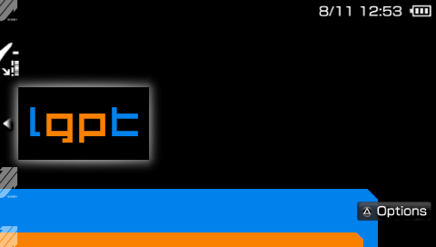

# LittleGPTracker

LittleGPTracker (a.k.a 'The piggy') is a music tracker optimised to run on portable game consoles.

# Customization

With proper settings, it looks like this:




```
<BACKGROUND  value="000000"/>
<FOREGROUND  value="0081EB"/>
<HICOLOR1    value="474747"/>
<HICOLOR2    value="FA8100"/>
<CURSORCOLOR value="FA8100"/>
```
